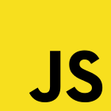

- title : F# in Azure
- description : How to use F# to create azure websites and use Azure .NET SDK from F#
- author : Olav Nybø
- theme : sky 
- transition : default

*** 

## Azure Websites

#F# 

***

***

- Hvorfor F#
- Basic F# Azure Web Site
- Azure DocumentDB
- Railway Oriented Programming
- Azure Web Site med DocumentDB i F# og Chessie
- DocumentDB TypeProvider

***

### Olav Nybø
- Twitter; @onybo
- Mail: olav.nybo@novanet.no
- Dagtid: C# og  TypeScript hos If
- Kveldstid: F#

***

### MVC / Web API

    [lang=cs]
    [RoutePrefix("persons")]
    public class PersonsController : Controller
    {
      private readonly IPersonRepository _personRepository;
      
      public PersonsController(IPersonRepository personRepository)
      {
        _personRepository = personRepository;
      }
      
      // eg.: /persons
      [Route]
      public ActionResult Index()
      {
        var persons = _personsRepository.GetPersons();
        return View(persons);
      }
      
      // eg.: /persons/5
      [Route("{personId}")]
      public ActionResult Show(int personId) { ... }
    }

---

### SOLID
#### Interface Segregation Principle
#### Single Responsibility

    [lang=cs]
    public interface IPersonRepository
    {
      IEnumerable<Person> GetPersons();
      void SaveChanges();
      void UpdatePerson(Person person);
      void DeletePerson(Person person);
      ...
    }

---

    [lang=cs]
    public PersonsWithQuery
    {
      public PersonsQuery(DbContext context)
      {
        ...
      }

      public IEnumerable<Person> GetPersons()
      {
         from dbContext where bla bla bla....
      }
    }

***

### Hvorfor F#?

    // simple types in one line
    type Person = {First:string; Last:string}
    
    // complex types in a few lines
    type Employee =
      | Worker of Person
      | Manager of Employee list
  
    // type inference
    let jdoe = {First="John";Last="Doe"}
    let worker = Worker jdoe

***

---

 

***

# DEMO
- C# web project med F# controllers
- F# MVC 5 / F# Web Item Templates
- ASP.NET 5 project

***

### Azure DocumentDb

- NoSql Database
- SQL
- JSON dokumenter

***

### Azure DocumentDb struktur

***

## DEMO
### [Azure portal](https://portal.azure.com)
 
 - Create database
 - URI and Keys
 - Document Explorer
 - Query Explorer

***

### Azure SDKs

 

***

***

    public class DocumentsFetcher
    {
        private static string EndpointUrl = "<your endpoint URI>";
        private static string AuthorizationKey = "<your key>";

        public IEnumerable<Document> GetDocuments()
        {
            var client = new DocumentClient(new Uri(EndpointUrl), AuthorizationKey);
            var database = client.CreateDatabaseQuery()
                                 .Where(db => db.Id == "OlavsDemoDB")
                                 .AsEnumerable()
                                 .FirstOrDefault();

            if (database == null)
            {
               return Enumerable.Empty<Document>();
            }

            var collection = client
                             .CreateDocumentCollectionQuery(database.SelfLink)
                             .Where(c => c.Id == "Persons")
                             .ToArray()
                             .FirstOrDefault();

            return client
                   .CreateDocumentQuery<Document>
                             (documentCollection.DocumentsLink)
                   .ToList();
        }
    }

***

### F# Pipelines

    getDocumentClient uri password
    |> getDatabase "OlavsDemoDb"
    |> getCollection "Persons"
    |> getDocuments

---

Railway oriented programming

---

### Chessie

    type Result<'TSuccess, 'TMessage> = 
    | Ok of 'TSuccess * 'TMessage list
    | Fail of 'TMessage list

---

---

---

### Railways

    use client = new DocumentClient(uri, password)
    client
    |> getDatabase "OlavsDemoDb"
    >>= getOrCreateCollectionSync client
    >>= getDocuments client
    |> either showDocuments showErrorMessages
    |> ignore
***

# DEMO

***

# ?

- Azure portal: [https://portal.azure.com](https://portal.azure.com)
- Azure DocumentDb: [http://azure.microsoft.com/en-us/documentation/services/documentdb/](http://azure.microsoft.com/en-us/documentation/services/documentdb/)
- Info om Railway Oriented Programming: [http://fsharpforfunandprofit.com/posts/recipe-part2/](http://fsharpforfunandprofit.com/posts/recipe-part2/) og [video her](http://vimeo.com/97344498)
- Chessie - ett F# bibliotek for ROP: [http://fsprojects.github.io/Chessie/reference/chessie-rop.html](http://fsprojects.github.io/Chessie/reference/chessie-rop.html)
- Gratis online kurs i F#: [http://www.tryfsharp.org/Learn](http://www.tryfsharp.org/Learn)

